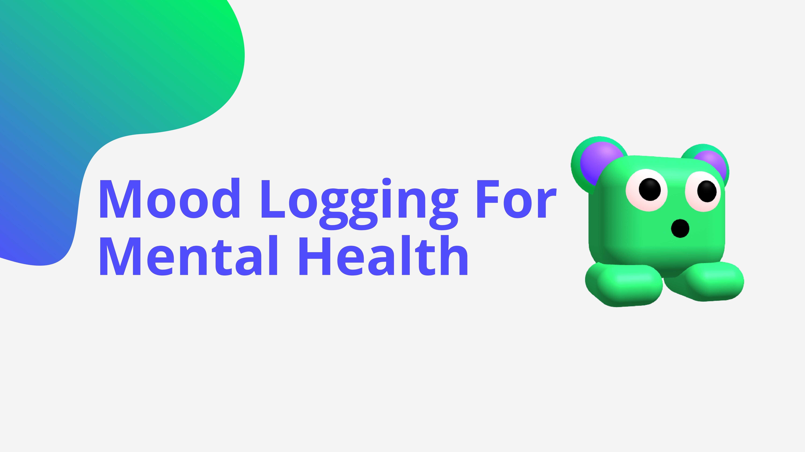
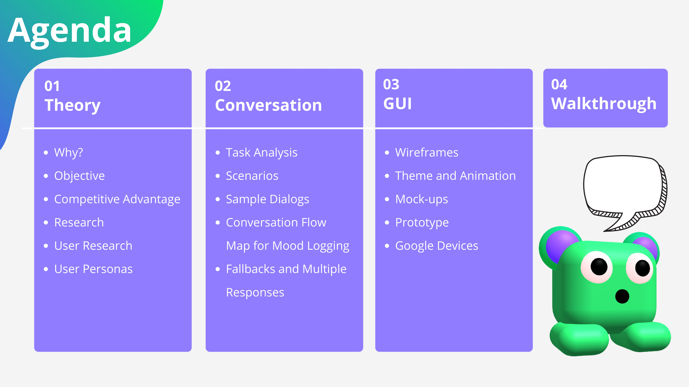
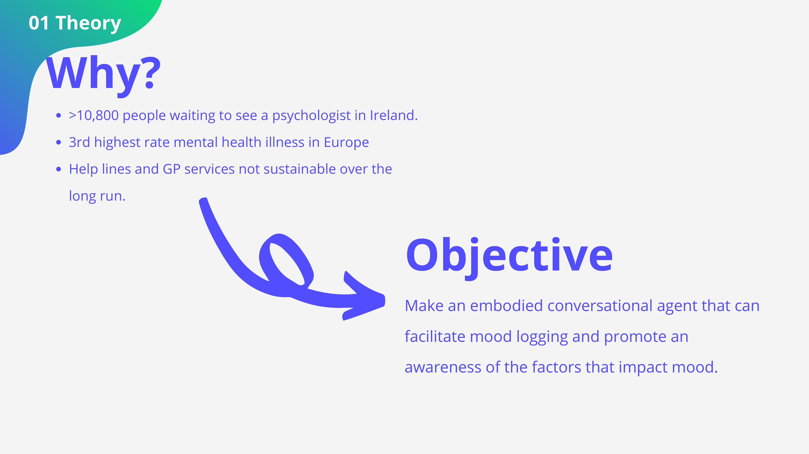
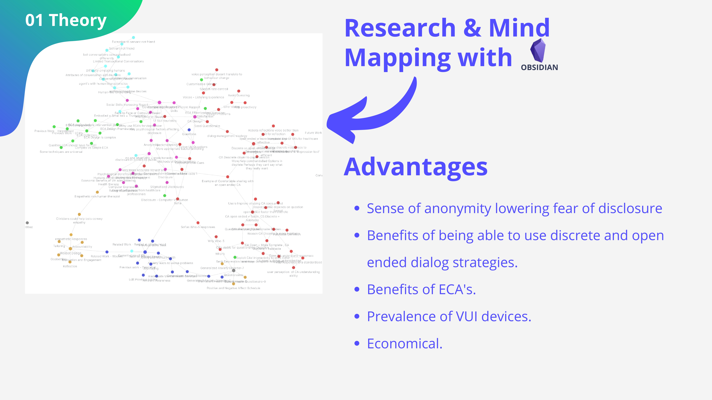
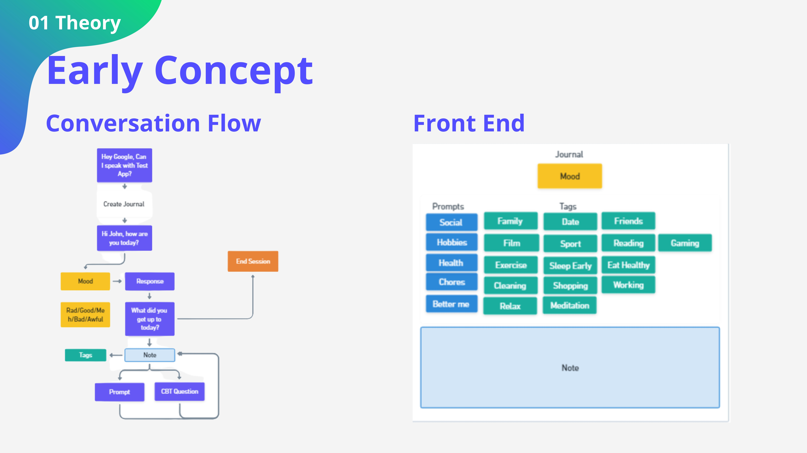
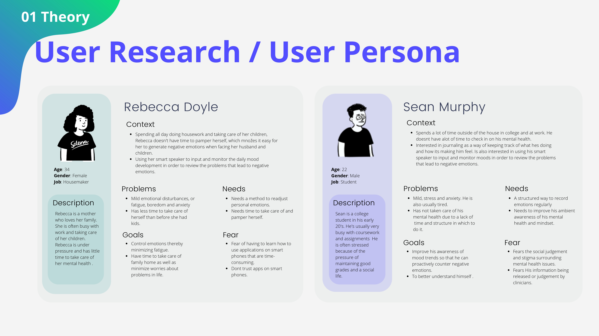
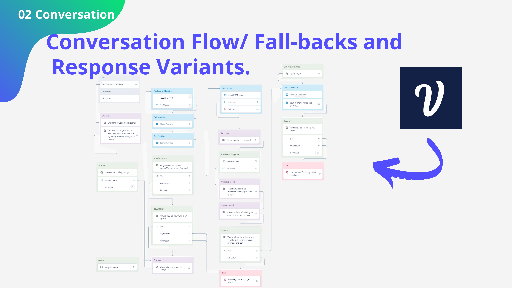
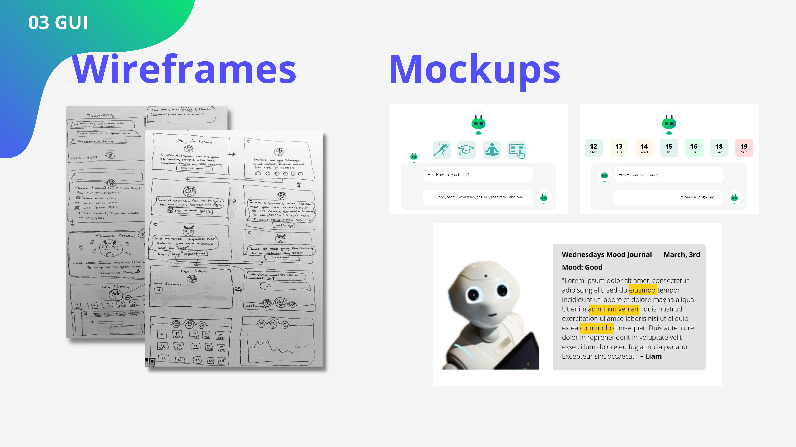
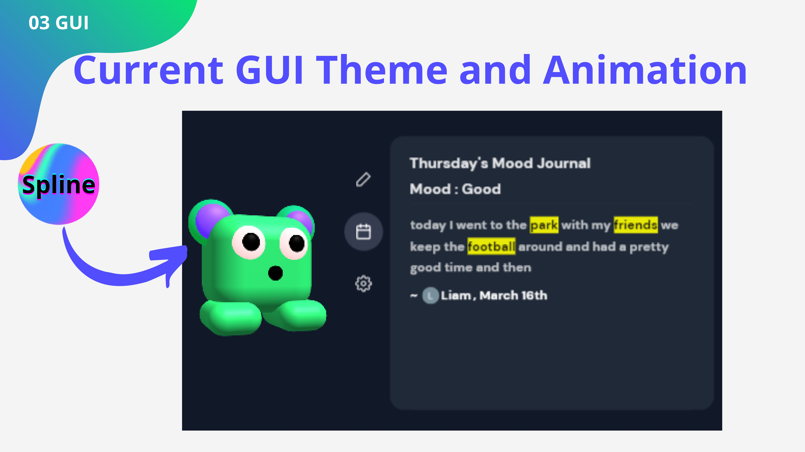
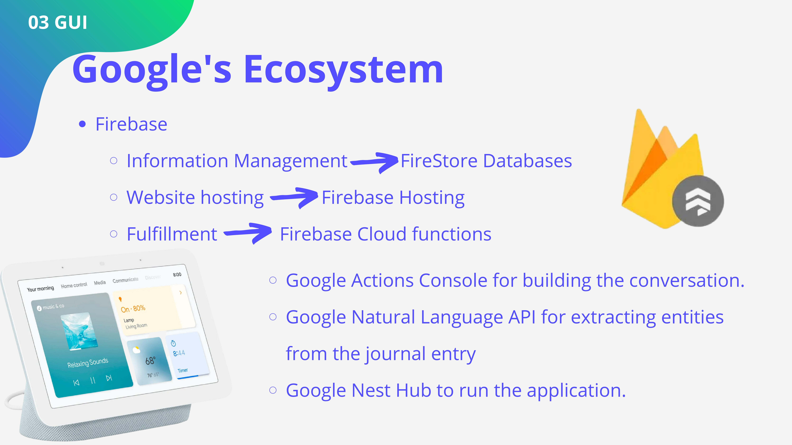

# Voice-Mood-Logging-for-Nest-Hub-with-Google-Assistant
My Final Year Project which aims to leverage voice user interface technology to improve mental health reporting. 

Abstract
 An awareness of the symptoms of one’s own low moods and anxiety is an essential step in treating them. Improvements in natural language understanding and the mass adoption of virtual assistant devices have broadened the scope of possibility for self-monitoring applications. Interest in their potential to advance mental health supports is well established as one of the most common Alexa commands during the summer of 2017 was “Alexa help me relax” (Anders, 2022).  Considering the high demand yet low supply for mental health services, the efficacy of self-help mental health supports, and recent developments in voice technology,  an opportunity exists to streamline the self-monitoring process using a more natural medium, voice. therefore, a complex design problem arises. How best to design such an agent? This project examines the potential of voice user interface devices for the purposes of self monitoring by developing a voice mood logging application. The application which promotes knowledge of one’s mental health and related factors rund on a Google Nest Hub Device. The design of the application is informed by past research and inspired by aspects of cognitive behavioural therapy which focus on organising ones thoughts.

  
  
  
  
  
  
  
  
  
  
  

